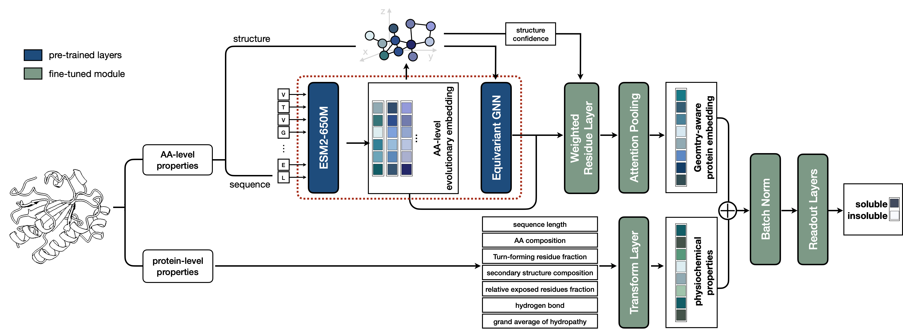
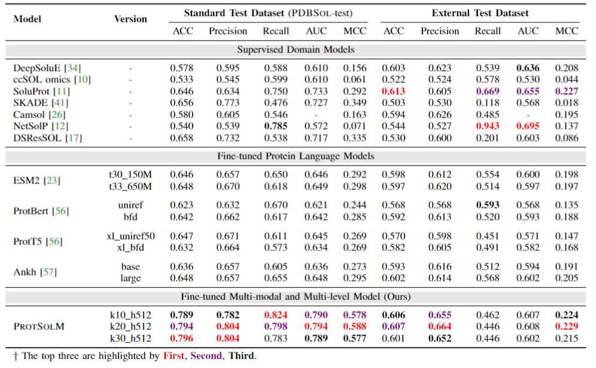

# ProtSolM: Protein Solubility Prediction with Multi-modal Features

## 🚀 Introduction (ProtSolM)

Fusion of **sequence, structure and feature** information to improve protein solubility prediction!



## 📑 Results

### News

- [2024.07.31] Congratulations! Our paper was accepted as a short paper at *IEEE International Conference on Bioinformatics and Biomedicine 2024 (IEEE BIBM 2024)*!

### Paper Results



### Downloads

**PDBSol** and **ExternalTest** pdb files can be found at https://huggingface.co/datasets/tyang816/ProtSolM_PDB.

The labels are stored in CSV files which can be found at `data/PDBSol` and `data/ExternalTest`.

```shell
cd data/PDBSol
wget https://huggingface.co/datasets/tyang816/ProtSolM_PDB/blob/main/ExternalTest_ESMFold_PDB.zip
unzip PDBSol_ESMFold_PDB.zip

cd data/ExternalTest
wget https://huggingface.co/datasets/tyang816/ProtSolM_PDB/blob/main/ExternalTest_ESMFold_PDB.zip
unzip ExternalTest_ESMFold_PDB.zip
```

## 🛫 Requirement

Please make sure you have installed Anaconda3 or Miniconda3.

```shell
conda env create -f environment.yaml
conda activate protsolm
```

## 🧬 Start with ProtSolM

### Download Pre-trained Checkpoints

We use the pre-trained checkpoints from [ProtSSN](https://github.com/tyang816/ProtSSN), we recommend using k20_h512 for fine-tuning on downstream tasks.

| # Version | # Param | # Link                                                       |
| --------- | ------- | ------------------------------------------------------------ |
| k10_h512  | 148     | https://huggingface.co/tyang816/ProtSSN/resolve/main/protssn_k10_h512.pt |
| k10_h768  | 160     | https://huggingface.co/tyang816/ProtSSN/resolve/main/protssn_k10_h768.pt |
| k10_h1280 | 184     | https://huggingface.co/tyang816/ProtSSN/resolve/main/protssn_k10_h1280.pt |
| k20_h512  | 148     | https://huggingface.co/tyang816/ProtSSN/resolve/main/protssn_k20_h512.pt |
| k20_h768  | 160     | https://huggingface.co/tyang816/ProtSSN/resolve/main/protssn_k20_h768.pt |
| k20_h1280 | 184     | https://huggingface.co/tyang816/ProtSSN/resolve/main/protssn_k20_h1280.pt |
| k30_h512  | 148     | https://huggingface.co/tyang816/ProtSSN/resolve/main/protssn_k30_h512.pt |
| k30_h768  | 160     | https://huggingface.co/tyang816/ProtSSN/resolve/main/protssn_k30_h768.pt |
| k30_h1280 | 184     | https://huggingface.co/tyang816/ProtSSN/resolve/main/protssn_k30_h1280.pt |

```shell
mkdir model
cd model
wget https://huggingface.co/tyang816/ProtSSN/resolve/main/protssn_k20_h512.pt
```

### Extract Features

```shell
python get_feature.py \
    --pdb_dir data/PDBSol/esmfold_pdb \
    --out_file data/PDBSol_feature.csv
```

### Start Testing

Script example can be found at `script/`.

```shell
K=20
H=512
lr=5e-4
pooling_method=attention1d
model_name=feature512_norm_pp_"$pooling_method"_k"$K"_h"$H"_lr"$lr"
CUDA_VISIBLE_DEVICES=0 python eval.py \
    --seed 3407 \
    --gnn_hidden_dim $H \
    --gnn_model_path model/protssn_k"$K"_h"$H".pt \
    --pooling_method $pooling_method \
    --model_dir ckpt \
    --model_name $model_name.pt \
    --num_labels 2 \
    --supv_dataset data/PDBSol \
    --test_file data/PDBSol/test.csv \
    --test_result_dir result/protssn_k"$K"_h"$H"/$model_name/test \
    --feature_file data/PDBSol/PDBSol_feature.csv \
    --feature_name "aa_composition" "gravy" "ss_composition" "hygrogen_bonds" "exposed_res_fraction" "pLDDT" \
    --use_plddt_penalty \
    --feature_embed_dim 512 \
    --c_alpha_max_neighbors $K \
    --batch_token_num 16000
```

### Start Fine-tuning

Script example can be found at `script/`.

```shell
K=20
H=512
pooling_method=attention1d
model_name=feature_"$pooling_method"_k"$K"_h"$H"
CUDA_VISIBLE_DEVICES=0 python run_ft.py \
    --seed 3407 \
    --gnn_hidden_dim $H \
    --gnn_model_path model/protssn_k"$K"_h"$H".pt \
    --pooling_method $pooling_method \
    --model_dir result/sol/debug/protssn_k"$K"_h"$H" \
    --model_name $model_name.pt \
    --num_labels 2 \
    --supv_dataset data/PDBSol \
    --train_file data/PDBSol/train.csv \
    --valid_file data/PDBSol/valid.csv \
    --test_file data/PDBSol/test.csv \
    --feature_file data/PDBSol/PDBSol_feature.csv \
    --feature_name "aa_composition" "gravy" "ss_composition" "hygrogen_bonds" "exposed_res_fraction" "pLDDT" \
    --c_alpha_max_neighbors $K \
    --learning_rate 5e-4 \
    --num_train_epochs 10 \
    --batch_token_num 16000 \
    --gradient_accumulation_steps 1 \
    --patience 3 \
    --wandb \
    --wandb_entity ty_ang \
    --wandb_project protssn-sol_debug \
    --wandb_run_name $model_name
```